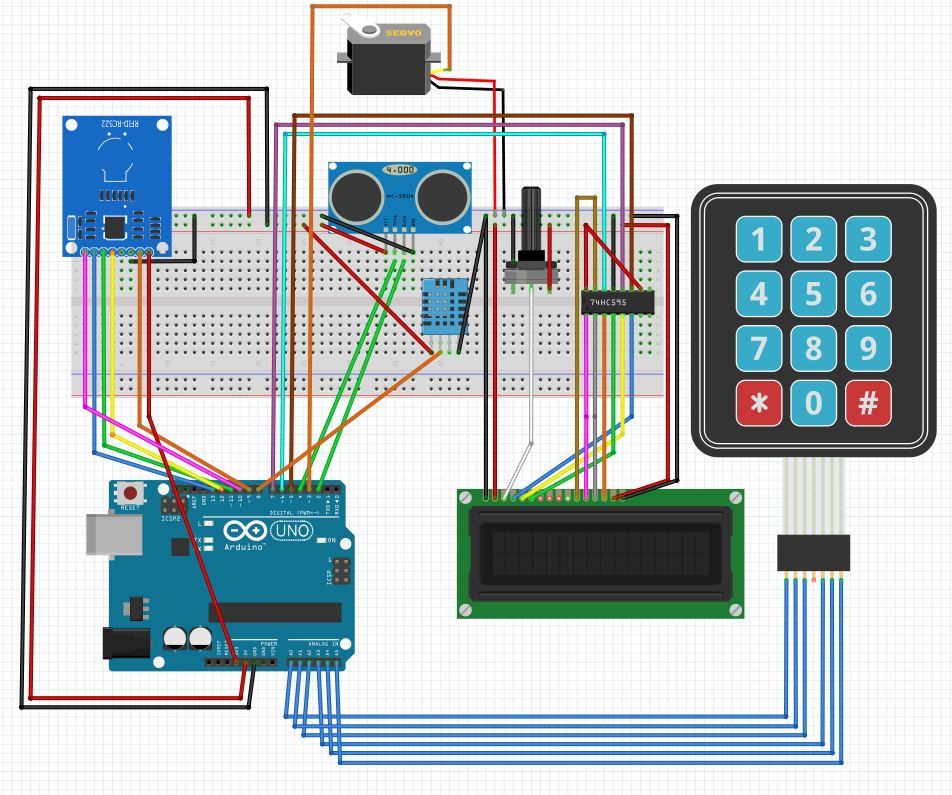

# PROJECT ARDUINO - COVID 19 ACCESS CONTROL
## Introduction
The PROJECT ARDUINO - COVID 19 ACCESS CONTROL project is a cutting-edge solution for managing access to a specific location while ensuring the safety and health of those who enter.

By utilizing an Arduino board, the system is able to verify access through multiple methods, including RFID cards or badges and PIN codes. This allows for a convenient and secure way for authorized users to gain entry.

In addition to the initial verification, the system also employs an ultrasonic sensor to ensure the user is in the correct proximity to the sensor, and a temperature sensor to detect fever. The recommended sensor for this purpose is the MLX90614, but due to the current shortage of this sensor, a simple temperature sensor is used as an alternative. This ensures that only healthy individuals are allowed entry, helping to prevent the spread of COVID-19.

Once all checks have been completed and the user has met all necessary conditions, the system uses an actuator, a servo motor, to simulate the opening of a lock with a 90-degree movement. This grants access to the user and allows them to enter the location safely and securely.

## Features
- Access control through RFID cards or badges and PIN codes
- Ultrasonic sensor for proximity check
- Temperature sensor for fever detection
- Servo motor for lock simulation

## Project Image

